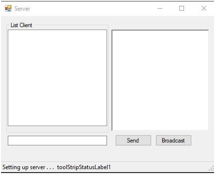
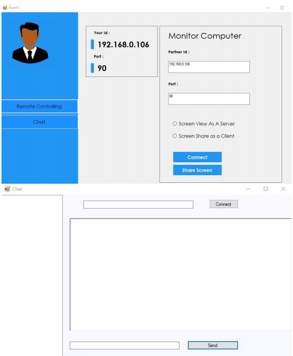

# Client/Server Chat Application
## Introduction:
    Network is to connect two or more computers
together with the ability to communicate with each other.
Networking is to link two or more computing devices
together for the purpose of sharing data.

Project is based on Client/Server Chat application in which
multiple client can request server and chat with server .
Server has the ability to perform unicasting , multicasting
and broadcasting.

The other feature in this app is screen sharing in which
two clients with known ip on same network can share
their screen and see their screen.

## Features
### 1. Messaging:
Administrator can communicate with the remote
systems that are connected With in the local network
administrator can communicate publicly or privately.
Messaging is nothing but passing data to and from
applications over the network which makes the
synchronisation of data simple. Messaging allows
users across the network to exchange data in real
time. Most commonly, these data consist of typed
conversations, but the power of the system lies in its
ability to pass other data as well. This could be in the
form of audio or video or, as will be presented here,
other text data that will allow the two chatting
parties to retrieve the same data base record by
sending a primary key or keys from one to the other.

### 2. Screen Sharing:
Desktop Sharing is a server application that
allows to share current session with a user on
another machine, who can use a client to view or
even control the desktop. Desktop Sharing lets users
call a remote computer to access its shared desktop
and applications.With the Desktop sharing we can 
operate our office computer from our home or
viceversa But in this application you can only see other client
screen .

## Screenshots:
### Server

### client

